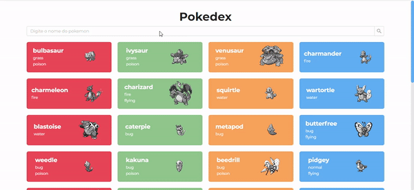

# Pokedex

> Web application to explore the pokemons api

<a href="https://github.com/joaovictorpsantos">

</a>

<a href="#">

</a>

<a href="https://github.com/joaovictorpsantos/pokedex/stargazers">

</a>

<a href="https://github.com/joaovictorpsantos/pokedex/network/members">

</a>

<a href="#">

</a>

<a href="https://github.com/joaovictorpsantos/social-app/commits/master">

</a>

<p align="center">
   
</p>

# :pushpin: Table of Contents

- [Features](#rocket-features)
- [Goals](#dart-goals)
- [Installation](#construction_worker-installation)
- [Getting Started](#runner-getting-started)
- [FAQ](#postbox-faq)
- [Found a bug? Missing a specific feature?](#bug-issues)
- [Contributing](#tada-contributing)
- [License](#closed_book-license)

# :rocket: Features

- Browse the list of pokemons always looking for more
- Search for a specific pokemon by name
- By clicking on one of the cards, check the pokemon's abilities

# :dart: Design Patterns

- [Ant Design](https://ant.design/) Design System used
- [EditorConfig] used
- [Prettier] used
- Global Styling with [Stlyed Components](https://styled-components.com/)
- Paging every 20 pokemons
- Animation in the pokenos list made with [react-reveal](https://www.react-reveal.com/)
- Each file has the name of the component and is not exported by default, so when importing, use the name it was created with.
- Added test example (I know this is just a small example, but I will test the entire application) [React Testing Library](https://testing-library.com/docs/react-testing-library/intro/)
- Using Spinner for visual feedback to user while api calls are in progress
- Setting the colors used in the global style file application
- Method created in utils folder for handling errors in API calls
- Methods that make calls to the api start with the name 'fetch'
- Comments on imports and instances in the files
- Interface reuse through shared folder
- Reuse of components through shared folder
- .env.example file for documentation
- Type entire application
- Semantic commits

# :construction_worker: Installation

**You need to install [Node.js](https://pt-br.reactjs.org/) and [Yarn](https://yarnpkg.com/) first, then in order to clone the project via HTTPS, run this command:**

```
  git clone https://github.com/joaovictorpsantos/pokedex.git
```

SSH URLs provide access to a Git repository via SSH, a secure protocol. If you have a SSH key registered in your Github account, clone the project using this command:

```
  git clone git@github.com:joaovictorpsantos/pokedex.git
```

**Install dependencies**

```
  yarn install
```

# :runner: Getting Started

Run the following command in order to start the application in a development environment:

```
  yarn start
```

# :postbox: Faq

**Question:** What are the tecnologies used in this project?

**Answer:** The tecnologies used in this project are [ReactJS](https://pt-br.reactjs.org/) + [TypeScript](https://www.typescriptlang.org/) [Ant Design](https://ant.design/)

<br/>

<h4 align="center">
  Let's share knowledge and grow together!!!
</h4>

<br/>

---

<h3 align="center">
Author: <a alt="João Victor Pereira Santos" href="https://github.com/joaovictorpsantos">João Victor Pereira Santos</a>
</h3>

<p align="center">

  <a alt="João Victor Pereira Santos Linkedin" href="https://www.linkedin.com/in/joao-victor-pereira-santos//">
    </a>
  <a alt="João Victor Pereira Santos GitHub" href="https://github.com/joaovictorpsantos">
  </a>
 <a alt="João Victor Pereira Santos Twitter" href="https://twitter.com/_joaovictorps">
  </a>

</p>
